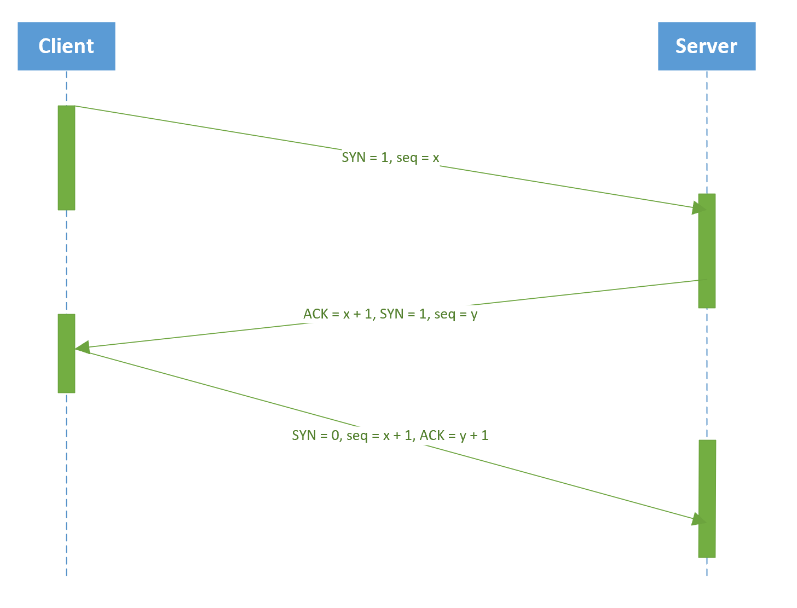
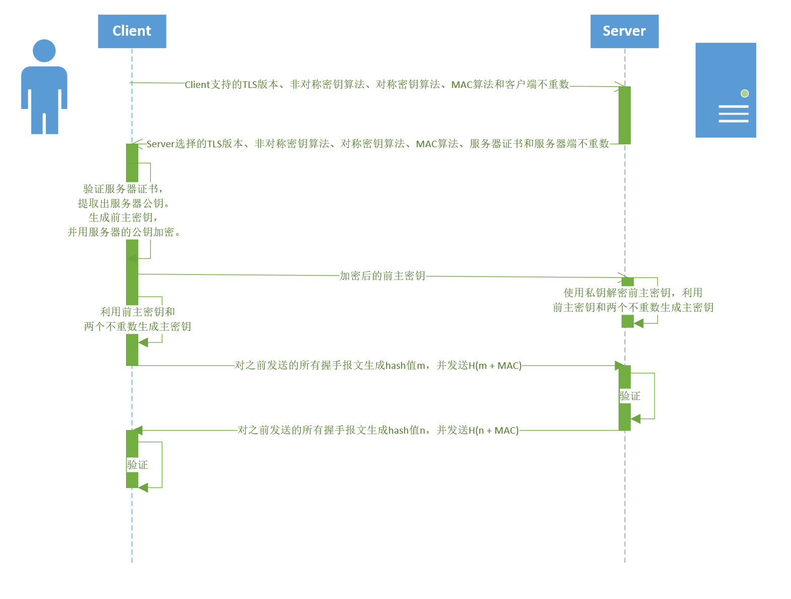

# what-happens-when
对于一些步骤添加了更详细地描述和其流程图，主要的变动为 TLS 原理，Servlet 生命周期和 CDN 过程。原仓库 https://github.com/skyline75489/what-happens-when-zh_CN

因为原仓库是英文版的中文对照无法改动，所以我新建了这个仓库。主要的参考文献——计算机网络：自顶向下方法（原书第七版）

当···时发生了什么？
===================

这个仓库试图回答一个古老的面试问题：当你在浏览器中输入 google.com 并且按下回车之后发生了什么？

不过我们不再局限于平常的回答，而是想办法回答地尽可能具体，不遗漏任何细节。

这将是一个协作的过程，所以深入挖掘吧，并且帮助我们一起完善它。仍然有大量的细节等待着你来添加，欢迎向我们发送 Pull Requset！

这些内容使用 `Creative Commons Zero` 协议发布。

# 目录

* [按下"g"键](#按下g键)
* [按下回车键](#按下回车键)
  * [产生中断[非USB键盘]](#产生中断非usb键盘)
  * [(Windows)一个 ``WM_KEYDOWN`` 消息被发往应用程序](#windows一个-wm_keydown-消息被发往应用程序)
  * [(Mac OS X)一个 ``KeyDown`` NSEvent被发往应用程序](#mac-os-x一个-keydown-nsevent被发往应用程序)
  * [(GNU/Linux)Xorg 服务器监听键码值](#gnulinuxxorg-服务器监听键码值)
* [URL解析](#url解析)
  * [输入的是 URL 还是搜索的关键字？](#输入的是-url-还是搜索的关键字)
  * [转换非 ASCII 的 Unicode 字符](#转换非-ascii-的-unicode-字符)
  * [检查 HSTS 列表](#检查-hsts-列表)
* [域名解析 (DNS)](#域名解析-dns)
* [ARP 过程](#arp-过程)
* [使用套接字](#使用套接字)
* [TLS](#tls)
  * [TLS中的基础概念：](#tls中的基础概念)
  * [TLS握手过程](#tls握手过程)
* [HTTP 协议](#http-协议)
* [HTTP 服务器请求处理](#http-服务器请求处理)
* [内容分发网络（Content Distribution Network, CDN）](#内容分发网络content-distribution-network-cdn)
* [浏览器背后的故事](#浏览器背后的故事)
* [浏览器](#浏览器)
* [HTML 解析](#html-解析)
  * [解析算法](#解析算法)
  * [页面渲染](#页面渲染)
  * [GPU 渲染](#gpu-渲染)
* [后期渲染与用户引发的处理](#后期渲染与用户引发的处理)

# 按下"g"键

接下来的内容介绍了物理键盘和系统中断的工作原理，但是有一部分内容却没有涉及。当你按下“g”键，浏览器接收到这个消息之后，会触发自动完成机制。浏览器根据自己的算法，以及你是否处于隐私浏览模式，会在浏览器的地址框下方给出输入建议。大部分算法会优先考虑根据你的搜索历史和书签等内容给出建议。你打算输入 "google.com"，因此给出的建议并不匹配。但是输入过程中仍然有大量的代码在后台运行，你的每一次按键都会使得给出的建议更加准确。甚至有可能在你输入之前，浏览器就将 "google.com" 建议给你。

# 按下回车键

为了从零开始，我们选择键盘上的回车键被按到最低处作为起点。在这个时刻，一个专用于回车键的电流回路被直接地或者通过电容器间接地闭合了，使得少量的电流进入了键盘的逻辑电路系统。这个系统会循环扫描每个键的状态，对于按键开关的电位弹跳变化进行噪音消除(debounce)，并将其转化为键盘码值。在这里，回车的码值是13。键盘控制器在得到码值之后，将其编码，用于之后的传输。现在这个传输过程几乎都是通过通用串行总线(USB)或者蓝牙(Bluetooth)来进行的，以前是通过PS/2或者ADB连接进行。

**USB键盘：**

- 键盘的USB元件通过计算机上的USB接口与计算机的USB控制器相连接，USB接口中的第一号针为它提供了5V的电压

- 键码值存储在键盘内部电路一个叫做"endpoint"的寄存器内

- USB控制器大概每隔10ms便查询一次"endpoint"以得到存储的键码值数据，这个最短时间间隔由键盘提供

- 键值码值通过USB串行接口引擎被转换成一个或者多个遵循低层USB协议的USB数据包

- 这些数据包通过D+针或者D-针(中间的两个针)，以最高1.5Mb/s的速度从键盘传输至计算机。速度限制是因为人机交互设备总是被声明成"低速设备"（USB 2.0 compliance）

- 这个串行信号在计算机的USB控制器处被解码，然后被人机交互设备通用键盘驱动进行进一步解释。之后按键的码值被传输到操作系统的硬件抽象层

**虚拟键盘（触屏设备）：**

- 在现代电容屏上，当用户把手指放在屏幕上时，一小部分电流从传导层的静电域经过手指传导，形成了一个回路，使得屏幕上触控的那一点电压下降，屏幕控制器产生一个中断，报告这次“点击”的坐标

- 然后移动操作系统通知当前活跃的应用，有一个点击事件发生在它的某个GUI部件上了，现在这个部件是虚拟键盘的按钮

- 虚拟键盘引发一个软中断，返回给OS一个“按键按下”消息

- 这个消息又返回来向当前活跃的应用通知一个“按键按下”事件

## 产生中断[非USB键盘]

键盘在它的中断请求线(IRQ)上发送信号，信号会被中断控制器映射到一个中断向量，实际上就是一个整型数。CPU使用中断描述符表(IDT)把中断向量映射到对应函数，这些函数被称为中断处理例程，它们由操作系统内核提供。当一个中断到达时，操作系统陷入内核态，CPU根据IDT和中断向量索引到对应的中断处理例程。

## (Windows)一个 ``WM_KEYDOWN`` 消息被发往应用程序

HID把键盘按下的事件传送给 ``KBDHID.sys`` 驱动，把HID的信号转换成一个扫描码(Scancode)，这里回车的扫描码是 ``VK_RETURN(0x0d)``。 ``KBDHID.sys`` 驱动和 ``KBDCLASS.sys`` (键盘类驱动,keyboard class driver)进行交互，这个驱动负责安全地处理所有键盘和小键盘的输入事件。之后它又去调用 ``Win32K.sys`` ，在这之前有可能把消息传递给安装的第三方键盘过滤器。这些都是发生在内核模式。

``Win32K.sys`` 通过 ``GetForegroundWindow()`` API函数找到当前哪个窗口是活跃的。这个API函数提供了当前浏览器的地址栏的句柄。Windows系统的"message pump"机制调用 ``SendMessage(hWnd, WM_KEYDOWN, VK_RETURN, lParam)`` 函数， ``lParam`` 是一个用来指示这个按键的更多信息的掩码，这些信息包括按键重复次数（这里是0），实际扫描码（可能依赖于OEM厂商，不过通常不会是 ``VK_RETURN`` ），功能键（alt, shift, ctrl）是否被按下（在这里没有），以及一些其他状态。

Windows的 ``SendMessage`` API直接将消息添加到特定窗口句柄 ``hWnd`` 的消息队列中，之后赋给 ``hWnd`` 的主要消息处理函数 ``WindowProc`` 将会被调用，用于处理队列中的消息。

当前活跃的句柄 ``hWnd`` 实际上是一个edit control控件，这种情况下，``WindowProc`` 有一个用于处理 ``WM_KEYDOWN`` 消息的处理器，这段代码会查看 ``SendMessage`` 传入的第三个参数 ``wParam`` ，因为这个参数是 ``VK_RETURN`` ，于是它知道用户按下了回车键。

## (Mac OS X)一个 ``KeyDown`` NSEvent被发往应用程序

中断信号引发了I/O Kit Kext键盘驱动的中断处理事件，驱动把信号翻译成键码值，然后传给OS X的 ``WindowServer`` 进程。然后， ``WindowServer`` 将这个事件通过Mach端口分发给合适的（活跃的，或者正在监听的）应用程序，这个信号会被放到应用程序的消息队列里。队列中的消息可以被拥有足够高权限的线程使用 ``mach_ipc_dispatch`` 函数读取到。这个过程通常是由 ``NSApplication`` 主事件循环产生并且处理的，通过 ``NSEventType`` 为 ``KeyDown`` 的 ``NSEvent`` 。

## (GNU/Linux)Xorg 服务器监听键码值

当使用图形化的 X Server 时，X Server 会按照特定的规则把键码值再一次映射，映射成扫描码。当这个映射过程完成之后， X Server 把这个按键字符发送给窗口管理器(DWM，metacity, i3等等)，窗口管理器再把字符发送给当前窗口。当前窗口使用有关图形API把文字打印在输入框内。

# URL解析

* 浏览器通过 URL 能够知道下面的信息：

    - ``Protocol`` "http"
        使用HTTP协议
    - ``Resource`` "/"
        请求的资源是主页(index)

## 输入的是 URL 还是搜索的关键字？

* 当协议或主机名不合法时，浏览器会将地址栏中输入的文字传给默认的搜索引擎。大部分情况下，在把文字传递给搜索引擎的时候，URL会带有特定的一串字符，用来告诉搜索引擎这次搜索来自这个特定浏览器。

## 转换非 ASCII 的 Unicode 字符

* 浏览器检查输入是否含有不是 ``a-z``， ``A-Z``，``0-9``， ``-`` 或者 ``.`` 的字符
* 这里主机名是 ``google.com`` ，所以没有非ASCII的字符；如果有的话，浏览器会对主机名部分使用 `Punycode`  编码

## 检查 HSTS 列表

* 浏览器检查自带的“预加载 HSTS（HTTP严格传输安全）”列表，这个列表里包含了那些请求浏览器只使用 HTTPS 进行连接的网站
* 如果网站在这个列表里，浏览器会使用 HTTPS 而不是 HTTP 协议，否则，最初的请求会使用 HTTP 协议发送
* 注意，一个网站哪怕不在 HSTS 列表里，也可以要求浏览器对自己使用 HSTS 政策进行访问。浏览器向网站发出第一个 HTTP 请求之后，网站会返回浏览器一个响应，请求浏览器只使用 HTTPS 发送请求。然而，就是这第一个 HTTP 请求，却可能会使用户受到 `downgrade attack` 的威胁，这也是为什么现代浏览器都预置了 HSTS 列表。

# 域名解析 (DNS)

* 浏览器检查域名是否在缓存当中（要查看 Chrome 当中的缓存， 打开 [chrome://net-internals/#dns](chrome://net-internals/#dns)。
* 如果缓存中没有，就去调用 ``gethostbyname`` 库函数（操作系统不同函数也不同）进行查询。
* ``gethostbyname`` 函数在试图进行 DNS 解析之前首先检查域名是否在本地 ``hosts`` 文件中。
* 如果 ``gethostbyname`` 没有这个域名的缓存记录，也没有在 ``hosts`` 里找到，它将会向 DNS 服务器发送一条 DNS 查询请求。在新加入一个网络后，如果在操作系统没有配置静态 DNS 服务器地址，通常会先使用 DHCP 协议获取当前网络的网关地址和本地 DNS 服务器地址等信息。
* 若本地 DNS 服务器中没有此域名的信息，其会依次向顶级 DNS 服务器和权威 DNS 服务器发送查询请求。

# ARP 过程

ARP 的任务是获取目的 IP 地址所对应的 MAC 地址，要想发送 ARP（地址解析协议）广播，我们需要有一个目标 IP 地址，同时还需要知道用于发送 ARP 广播的接口的 MAC 地址。

* 首先查询 ARP 缓存，如果缓存命中，我们返回结果：目标 IP = MAC

如果缓存没有命中：

* 查看路由表，看看目标 IP 地址是不是在本地路由表中的某个子网内。是的话，使用跟那个子网相连的接口，否则使用与默认网关相连的接口。
* 查询选择的网络接口的 MAC 地址
* 我们发送一个二层（ `OSI 模型` 中的数据链路层）ARP 请求：

``ARP Request``::

    Sender MAC: interface:mac:address:here
    Sender IP: interface.ip.goes.here
    Target MAC: FF:FF:FF:FF:FF:FF (Broadcast)
    Target IP: target.ip.goes.here

根据连接主机和路由器的硬件类型不同，可以分为以下几种情况：

直连：

* 如果我们和路由器是直接连接的，路由器会返回一个 ``ARP Reply`` （见下面）。

集线器：

* 如果我们连接到一个集线器，集线器会把 ARP 请求向所有其它端口广播，如果路由器也“连接”在其中，它会返回一个 ``ARP Reply`` 。

交换机：

* 如果我们连接到了一个交换机，交换机会检查本地 CAM/MAC 表，看看哪个端口有我们要找的那个 MAC 地址，如果没有找到，交换机会向所有其它端口广播这个 ARP 请求。
* 如果交换机的 MAC/CAM 表中有对应的条目，交换机会向有我们想要查询的 MAC 地址的那个端口发送 ARP 请求
* 如果路由器也“连接”在其中，它会返回一个 ``ARP Reply``

``ARP Reply``::

    Sender MAC: target:mac:address:here
    Sender IP: target.ip.goes.here
    Target MAC: interface:mac:address:here
    Target IP: interface.ip.goes.here

现在我们有了 DNS 服务器或者默认网关的 IP 地址，我们可以继续 DNS 请求了：

* 使用 53 端口向 DNS 服务器发送 UDP 请求包，如果响应包太大，会使用 TCP 协议
* 如果本地/ISP DNS 服务器没有找到结果，它会发送一个递归查询请求，一层一层向高层 DNS 服务器做查询，直到查询到起始授权机构，如果找到会把结果返回

# 使用套接字

当浏览器得到了目标服务器的 IP 地址，以及 URL 中给出来端口号（http 协议默认端口号是 80， https 默认端口号是 443），它会调用系统库函数 ``socket`` ，请求一个
TCP流套接字，对应的参数是 ``AF_INET/AF_INET6`` 和 ``SOCK_STREAM`` 。

* 这个请求首先被交给运输层，在运输层请求被封装成 TCP segment。目标端口会被加上头部，源端口会在系统内核的动态端口范围内选取（Linux下是ip_local_port_range)
* TCP segment 被送往网络层，网络层首先会根据 MTU 的值（数据链路层的最大长度）将其分片，再在每一片前加入一个 IP 头部，里面包含了目标服务器的 IP 地址、本机的 IP 地址和当前片偏移等信息，把它封装成很多 IP datagram。
* 这个 IP datagram 接下来会进入链路层并被封装成数据帧 frame，因为在网络层已经进行过分片，所以其长度不会超过链路层 frame 的最大长度限制，链路层会在 IP datagram 的基础上加上 frame 头部，里面包含了本地内置网卡的 MAC 地址以及网关（本地路由器）的 MAC 地址等信息。像前面说的一样，如果内核不知道网关的 MAC 地址，它必须进行 ARP 广播来查询其地址。

到了现在，TCP 封包已经准备好了，可以使用下面的方式进行传输：

* `以太网`
* `WiFi`
* `蜂窝数据网络`

对于大部分家庭网络和小型企业网络来说，frame 会从本地计算机出发，经过本地网络，再通过调制解调器把数字信号转换成模拟信号，使其适于在电话线路，有线电视光缆和无线电话线路上传输。在传输线路的另一端，是另外一个调制解调器，它把模拟信号转换回数字信号，交由下一个 `网络节点` 处理。节点的目标地址和源地址将在后面讨论。

大型企业和比较新的住宅通常使用光纤或直接以太网连接，这种情况下信号一直是数字的，会被直接传到下一个 `网络节点` 进行处理。

最终封包会到达管理本地子网的路由器。在那里出发，它会继续经过自治区域(autonomous system, 缩写 AS)的边界路由器，其他自治区域，最终到达目标服务器。一路上经过的这些路由器会从 IP 数据报头部里提取出目标地址，并将封包正确地路由到下一个目的地。IP数据报头部 time to live (TTL) 域的值每经过一个路由器就减1，如果封包的TTL变为0，或者路由器由于网络拥堵等原因封包队列满了，那么这个包也会被路由器丢弃。

上面的发送和接收过程在 TCP 建立连接期间会发生很多次：

* 客户端选择一个初始序列号(ISN)，将设置了 SYN 位的封包发送给服务器端，表明自己要建立连接并设置了初始序列号
* 服务器端接收到 SYN 包，如果它可以建立连接：
   * 服务器端选择它自己的初始序列号
   * 服务器端设置 SYN 位，表明自己选择了一个初始序列号
   * 服务器端把 (客户端ISN + 1) 复制到 ACK 域，并且设置 ACK 位，表明自己接收到了客户端的第一个包
* 客户端通过发送下面一个封包来确认这次连接：
   * 自己的序列号+1
   * 接收端 ACK+1
   * 设置 ACK 位
   
**为什么需要三次握手**：如果只有两次握手，服务器返回给客户端的包可能丢失，此时客户端认为无法建立 TCP 连接，但是服务器已经为此次会话分配了资源（发送缓存，接收缓存），造成了服务器端的资源浪费。

* 数据通过下面的方式传输：
   * 当一方发送了N个 Bytes 的数据之后，将自己的 SEQ 序列号也增加N
   * 另一方确认接收到这个数据包（或者一系列数据包）之后，它发送一个 ACK 包，ACK 的值设置为接收到的数据包的最后一个序列号
   
* TCP 的拥塞控制：TCP 连接中的发送方和接收方各维护名为拥塞窗口 (cwnd, 用来控制发送端发送的速率) ，接收窗口 (rwcd, 代表接收缓存还有多少空间) 和ssthresh的变量。TCP 协议会自动将已发送但未被确认的包大小控制在 <= min(cwnd, rwcd)以保证不会超过接收缓存和发送缓存的小大。
1. 慢启动：cwnd 的初始值为1，如果 TTL 时间内收到了所有包的 ACK，则将值其乘2。
2. 拥塞避免：当发生了连续三个 ACK 包（例如当接收方收到了序号为10的包但是此时没有序号为5的包，则认为序号5到10的包丢失了，此时连续发送三个 ACK=5 的包）丢包事件后，系统则认为当前网络存在拥塞，set ssthresh = cwnd / 2, set cwnd = ssthresh并以线性的方式继续增长，即每一轮 cwnd += 1。
3. 快恢复：当发生了超时丢包事件（即发送方长时间没有收到 ACK），set ssthresh = cwnd / 2, set cwnd = 1，并以慢启动的方式到达 cwnd = ssthresh 后，然后以线性方式增长，即每轮 cwnd += 1。
   
* 关闭连接时：
   * 要关闭连接的一方发送一个 FIN 包
   * 另一方确认这个 FIN 包，并且发送自己的 FIN 包
   * 要关闭的一方使用 ACK 包来确认接收到了 FIN
   

# TLS

## TLS中的基础概念：

**对称密钥与非对称密钥的区别**

* 对称密钥：通信双方的密钥是相同的，其优点为加密和解密的速度较快，适合大量数据的加解密，例如对整个报文数据进行加解密。
* 非对称密钥：通信双方的密钥是不同的，分为公钥和私钥，通常使用 RSA 算法。若公钥为 A，私钥为 B，需要加密的数据为 m，其比较重要的性质为 A(B(m)) = B(A(m)) = m，即既可以用公钥加密然后私钥解密，也可以先私钥加密然后公钥解密。但是其缺点为运算量较大，适合较少的数据加解密。在 TLS 握手过程中，先使用非对称加密密钥获取对称加密密钥，然后使用对称加密密钥加解密数据。

**密码散列函数**

* 若密码散列函数以 m 为输入，可以得到一个固定长度的字符串 H(m)，其重要的性质为：若输入 x 和 y 不同，则 H(x) 和 H(y) 必然不同。

**报文鉴别码**

* 在讲解 TLS 握手前，先解释一下什么叫做报文鉴别码（Message Authentication Code，MAC），MAC 密钥是用来验证报文完整性的算法。试想如下情景：
* Client 生成报文 m 并利用密码散列函数计算 H(m)，将 H(m) 附加到报文 m 后生成拓展报文 (m, H(m))，并将拓展报文发送给 Server。
* Server 接收到 (m', H(m)) 后并通过 m' 和相同的密码散列函数 H 计算出 h = H(m')。若 h = H(m) 则 Server 认为一切正常。
上述方法存在明显的缺陷。若黑客生成虚假的报文 a，使用相同的密码散列函数计算出 h(a) 并将拓展报文 (a, h(a)) 发送给 Server，此时 Server 也认为一切正常。这时就需要 MAC 密钥了，其本质就是一个比特串。在 Client 和 Server 之间共享相同的 MAC 密钥 s，在每次通信时，使用 (m, H(m + s)) 作为拓展报文，此时黑客由于不知道 s 的值，即使生成了虚假报文也无法通过 Server 的一致性验证。

**数字签名**
* 如果要验证报文的完整性——即验证报文在传输过程中是否被修改过，我们需要在报文结尾加上数字签名。我们假设发送方和接收方存有一样的 MAC 密钥。
* 发送方首先使用密码散列函数对报文内容 m + MAC 密钥进行计算，得出固定长度的 ``指纹``，然后发送给接收方。接收方使用对报文内容和 MAC 密钥使用相同的密码散列函数计算出结果，若结果与``指纹``的内容一致，则报文没有被修改过。
* 该 ``指纹`` 也即该报文的数字签名

**数字证书认证机构（CA）**
* CA 可以验证某一域名的公钥是否是可信的，在 TLS 握手时，服务器会将自己的公钥发送给客户端，客户端使用浏览器预装的 CA 便可以验证该公钥的合法性。
* 在TLS握手时，服务器首先会向客户端发送使用数字证书认证机构（CA）私钥签发的服务器公开``证书``，证书中包含了网站的公钥和指纹等信息。客户端浏览器会预装权威 CA 的公钥，使用密码散列算法对证书生成散列块，然后使用相应 CA 的公钥解密证书中的指纹，并将结果与散列块对比，若相同则认为当前证书是可信的并提取出证书中的公钥。

## TLS握手过程

* 客户端发送一个 ``ClientHello`` 消息到服务器端，消息中同时包含了它的 Transport Layer Security (TLS) 版本，可用的对称加密算法、非对称加密算法、密码散列算法，以及一个客户端不重数。其中不重数是为了防止``连续重放攻击``，试想以下情景：若不包含不重数，若黑客嗅探了 Client 和 Server 之间所有的报文，并且第二天黑客向 Server 发送前一天与 Client 内容和顺序都相同的报文，Server 也将响应一样的报文，此时相同的业务会进行两次，若 Client 下单买了一件上衣，则第二天会再次扣款买一件相同的上衣。
* 服务器端向客户端返回一个 ``ServerHello`` 消息，消息中包含了服务器端的 TLS 版本，服务器所选择的对称加密算法、非对称加密算法、密码散列算法、一个服务器端不重数，以及使用数字证书认证机构（Certificate Authority，CA）私钥签发的服务器公开证书，客户端会使用``证书``中的公钥加密接下来的握手过程，直到协商生成一个新的对称密钥。
* 如果客户端验证服务器的公钥是可信的，就会生成一串伪随机数，该随机数被称为前主密钥（Pre-Master Secret），并使用服务器的公钥加密它，然后将加密过后的前主密钥发送给服务器。
* 服务器端收到后使用自己的私钥解密前主密钥。现在客户端和服务器都拥有了两个不重数和前主密钥，此时双方同时利用两个不重数和前主密钥计算出主密钥（Master Secret）。其中不重数保证了每次生成的主密钥都是不同的，倘若遇见了“连续重放攻击”，客户端和服务器的主密钥就会不同，从而导致握手失败。
* 客户端和服务器将前主密钥切片，生成四个密钥。分别是：从 Client 到 Server 的数据的会话加密密钥；从 Server 到 Client 的数据的会话加密密钥；从 Client 到 Server 的数据的 MAC 密钥；从 Server 到 Client 的数据的 MAC 密钥。其中会话加密密钥是对称密钥。
* 客户端对之前所有的握手报文生成一个 hash 值，并发送一个 ``Finished`` 消息给服务器端，其中包括使用对称密钥和 MAC 加密后的 hash 值。
* 服务器端也对之前所有的握手报文生成 hash 值，然后解密客户端发送来的信息，检查这两个值是否对应。如果对应，就向客户端发送一个 ``Finished`` 消息，也使用协商好的对称密钥加密。这里解释一下为什么要验证所有的握手报文，因为一开始的两个握手报文是使用明文进行传输的，黑客有可能修改客户端可用的加密算法，强迫该对话使用安全性较低的算法。
* 从现在开始，接下来整个 TLS 会话都使用对称秘钥进行加密，并且 MAC 密钥来验证报文的完整性，传输应用层（HTTP）内容。

**最后放一张自己画的时序图**

# HTTP 协议

如果浏览器是 Google 出品的，它不会使用 HTTP 协议来获取页面信息，而是会与服务器端发送请求，商讨使用 SPDY 协议。

如果浏览器使用 HTTP 协议而不支持 SPDY 协议，它会向服务器发送这样的一个请求::

    GET / HTTP/1.1
    Host: google.com
    Connection: close
    [其他头部]

“其他头部”包含了一系列的由冒号分割开的键值对，它们的格式符合HTTP协议标准，它们之间由一个换行符分割开来。（这里我们假设浏览器没有违反HTTP协议标准的bug，同时假设浏览器使用 ``HTTP/1.1`` 协议，不然的话头部可能不包含 ``Host`` 字段，同时 ``GET`` 请求中的版本号会变成 ``HTTP/1.0`` 或者 ``HTTP/0.9`` 。）

HTTP/1.1 定义了“关闭连接”的选项 "close"，发送者使用这个选项指示这次连接在响应结束之后会断开。例如：

    Connection:close

不支持持久连接的 HTTP/1.1 应用必须在每条消息中都包含 "close" 选项。

在发送完这些请求和头部之后，浏览器发送一个换行符，表示要发送的内容已经结束了。

服务器端返回一个响应码，指示这次请求的状态，响应的形式是这样的::

    200 OK
    [响应头部]

然后是一个换行，接下来有效载荷(payload)，也就是 ``www.google.com`` 的HTML内容。服务器下面可能会关闭连接，如果客户端请求保持连接的话，服务器端会保持连接打开，以供之后的请求重用。

如果浏览器发送的HTTP头部包含了足够多的信息（例如包含了 Etag 头部），以至于服务器可以判断出，浏览器缓存的文件版本自从上次获取之后没有再更改过，服务器可能会返回这样的响应::

    304 Not Modified
    [响应头部]

这个响应没有有效载荷，浏览器会从自己的缓存中取出想要的内容。

在解析完 HTML 之后，浏览器和客户端会重复上面的过程，直到HTML页面引入的所有资源（图片，CSS，favicon.ico等等）全部都获取完毕，区别只是头部的 ``GET / HTTP/1.1`` 会变成 ``GET /$(相对www.google.com的URL) HTTP/1.1`` 。

如果HTML引入了 ``www.google.com`` 域名之外的资源，浏览器会回到上面解析域名那一步，按照下面的步骤往下一步一步执行，请求中的 ``Host`` 头部会变成另外的域名。

# HTTP 服务器请求处理

HTTPD(HTTP Daemon)在服务器端处理请求/响应。最常见的 HTTPD 有 Linux 上常用的 Apache 和 nginx，以及 Windows 上的 IIS。

* HTTP 接收请求
* 服务器把请求拆分为以下几个参数：
    * HTTP 请求方法(``GET``, ``POST``, ``HEAD``, ``PUT``, ``DELETE``, ``CONNECT``, ``OPTIONS``, 或者 ``TRACE``)。直接在地址栏中输入 URL 这种情况下，使用的是 GET 方法
    * 域名：google.com
    * 请求路径/页面：/  (我们没有请求google.com下的指定的页面，因此 / 是默认的路径)
* 大多数服务器中都内置了 Servlet 容器用来处理客户端请求，例如 Tomcat，JBoss 等。
* 若是使用过 SpringMVC 搭建过服务器对于 HttpServlet 类绝对不会陌生，所有的 Servlet 类都是其子类，需要实现其 doGet 和 doPost 方法来处理请求。下面详细介绍 Servlet 的生命周期：
* 当客户端请求一个特定的 Servlet 时，服务其首先检查 JVM 中是否存在该 Servlet 实例。若是不存在，则先使用类加载器将该类加载到 JVM 中，然后创建新的实例，调用其 init() 方法进行初始化。
* 在确定 Servlet 实例存在后，服务其调用其 service()方法，并以一个 request 对象和 response 对象作为参数。需要注意的是，每当一个新的请求到来就新建一个新的线程来执行 service()方法。这样服务器就可以并行的处理多个请求。
* Servlet 会话(Session): 因为 HTTP 协议是无状态的，所以需要 Session 来跟踪会话并存储会话的信息。当 HttpServletRequest 类的 getSession()方法被调用时，服务器会要求客户端返回其浏览器中 Cookie 存储的 SessionId 的值，若为空则创建新的会话。收到 SessionId 值后服务器在内存中查找该 id 是否存在，若存在则证明该会话合法（该过程只适用于安全要求较低的网站）。
* 当服务器处理完请求后（一般是读取或者修改完数据库中的数据），需要将结果返回给用户。因为数据是动态生成的，而返回给用户的 HTML 页面是静态的，服务器通过一些脚本语言或者前端框架将数据动态写入 HTML 文档中，然后将其返回给用户。用户浏览器收到该文档后，就开启了解析过程。

# 内容分发网络（Content Distribution Network, CDN）

当客户端收到服务器的 HTTP 响应报文后，若响应码为 200，则首先解析 HTML 文档构建 DOM 树（后文有更详细的过程），当发现其有引入的外部资源时（图片，CSS，JS，视频和音频等等），则向相应地址发送请求获取资源，直到 HTML 页面引入的所有资源全部获取完毕。对于提供资源的服务器，最直接的方法是建立单一的数据中心或文件服务器。但这种方法存在三个问题。首先，如果客户远离数据中心，服务器到客户端分组将跨越许多通信链路并可能通过许多 ISP，会给用户带来恼人的时延；第二是资源可能经过相同的链路发送许多次，浪费了网络带宽增加了流量费用；最后，此方案还存在单点故障的问题。为了应付向分布于全世界的用户分发资源的挑战，CDN 出现了，如今几乎所有的视频流公司都使用 CDN。

* CDN 管理分布在多个地理位置上的服务器，它的每个服务器存储静态资源的副本，并且试图将每个用户请求定向到一个提供最好的用户体验的 CDN 位置。CDN 可以是 **专用 CDN** ，即它由内容提供商自己所有；另一种可以是 **第三方 CDN** ，它可以给多个内容提供商提供服务。
* 大多数 CDN 利用 DNS 来截获和重定向请求。现考虑以下情景：假设用户访问连接 linuspeng.com/1234，该页面包含视频资源，其由 “video” 以及该视频本身的独特标识符表示，网站使用第三方 CDN 公司 KingCDN 的服务，整个过程将分为以下五个步骤。
* （1）用户访问 linuspeng.com/1234 的 web 网页。
* （2）浏览器收到 HTTP 响应报文，假设浏览器构建 DOM 树后发现包含 URL 为 http://video.linuspeng.com/DSH5HJS 的视频资源时，用户主机发送对于 video.linuspeng.com 的 DNS 请求。
* （3）用户本地 DNS 服务器将该 DNS 请求中继到 linuspeng.com 的权威 DNS 服务器，该服务器发现 video.linuspeng.com 中的字符串 ”video“，随后向本地 DNS 服务器返回 KingCDN 域的一个主机名，如 a1105.kingCDN.com。
* （4）用户的本地 DNS 服务器则发送第二个请求，此时是对 a1105.kingCDN.com的 DNS 请求，从这个时刻开始，DNS 请求进入了 KingCDN 专用的 DNS 基础设施。最终，用户可以得到提供视频内容的 CDN 服务器的 IP 地址。
* （5）收到 KingCND 内容服务器的 IP 地址后，用户与该 IP 地址的服务器创建 TCP 连接，并且发送对该视频的 HTTP GET 请求获取视频内容，若该视频不存在，则 CDN 服务器从视频内容提供商获取相应视频后再将视频发送给用户。

# 浏览器背后的故事

当服务器提供了资源之后（HTML，CSS，JS，图片等），浏览器会执行下面的操作：

* 解析 —— HTML，CSS，JS
* 渲染 —— 构建 DOM 树 -> 渲染 -> 布局 -> 绘制

# 浏览器

浏览器的功能是从服务器上取回你想要的资源，然后展示在浏览器窗口当中。资源通常是 HTML 文件，也可能是 PDF，图片，或者其他类型的内容。资源的位置通过用户提供的 URI(Uniform Resource Identifier) 来确定。

浏览器解释和展示 HTML 文件的方法，在 HTML 和 CSS 的标准中有详细介绍。这些标准由 Web 标准组织 W3C(World Wide Web Consortium) 维护。

不同浏览器的用户界面大都十分接近，有很多共同的 UI 元素：

* 一个地址栏
* 后退和前进按钮
* 书签选项
* 刷新和停止按钮
* 主页按钮

**浏览器高层架构**

组成浏览器的组件有：

* **用户界面：** 用户界面包含了地址栏，前进后退按钮，书签菜单等等，除了请求页面之外所有你看到的内容都是用户界面的一部分
* **浏览器引擎：** 浏览器引擎负责让 UI 和渲染引擎协调工作
* **渲染引擎：** 渲染引擎负责展示请求内容。如果请求的内容是 HTML，渲染引擎会解析 HTML 和 CSS，然后将内容展示在屏幕上
* **网络组件：** 网络组件负责网络调用，例如 HTTP 请求等，使用一个平台无关接口，下层是针对不同平台的具体实现
* **UI后端：** UI 后端用于绘制基本 UI 组件，例如下拉列表框和窗口。UI 后端暴露一个统一的平台无关的接口，下层使用操作系统的 UI 方法实现
* **Javascript 引擎：** Javascript 引擎用于解析和执行 Javascript 代码
* **数据存储：** 数据存储组件是一个持久层。浏览器可能需要在本地存储各种各样的数据，例如 Cookie 等。浏览器也需要支持诸如 localStorage，IndexedDB，WebSQL 和 FileSystem 之类的存储机制

# HTML 解析

浏览器渲染引擎从网络层取得请求的文档，一般情况下文档会分成8kB大小的分块传输。

HTML 解析器的主要工作是对 HTML 文档进行解析，生成解析树。

解析树是以 DOM 元素以及属性为节点的树。DOM是文档对象模型(Document Object Model)的缩写，它是 HTML 文档的对象表示，同时也是 HTML 元素面向外部(如Javascript)的接口。树的根部是"Document"对象。整个 DOM 和 HTML 文档几乎是一对一的关系。

## 解析算法

HTML不能使用常见的自顶向下或自底向上方法来进行分析。主要原因有以下几点:

* 语言本身的“宽容”特性
* HTML 本身可能是残缺的，对于常见的残缺，浏览器需要有传统的容错机制来支持它们
* 解析过程需要反复。对于其他语言来说，源码不会在解析过程中发生变化，但是对于 HTML 来说，动态代码，例如脚本元素中包含的 `document.write()` 方法会在源码中添加内容，也就是说，解析过程实际上会改变输入的内容

由于不能使用常用的解析技术，浏览器创造了专门用于解析 HTML 的解析器。解析算法在 HTML5 标准规范中有详细介绍，算法主要包含了两个阶段：标记化（tokenization）和树的构建。

**解析结束之后**

浏览器开始加载网页的外部资源（CSS，图像，Javascript 文件等）。

此时浏览器把文档标记为可交互的（interactive），浏览器开始解析处于“推迟（deferred）”模式的脚本，也就是那些需要在文档解析完毕之后再执行的脚本。之后文档的状态会变为“完成（complete）”，浏览器会触发“加载（load）”事件。

注意解析 HTML 网页时永远不会出现“无效语法（Invalid Syntax）”错误，浏览器会修复所有错误内容，然后继续解析。

##CSS 解析

* 根据 `CSS词法和句法` 分析CSS文件和 ``<style>`` 标签包含的内容以及 `style` 属性的值
* 每个CSS文件都被解析成一个样式表对象（``StyleSheet object``），这个对象里包含了带有选择器的CSS规则，和对应CSS语法的对象
* CSS解析器可能是自顶向下的，也可能是使用解析器生成器生成的自底向上的解析器

## 页面渲染

* 通过遍历DOM节点树创建一个“Frame 树”或“渲染树”，并计算每个节点的各个CSS样式值
* 通过累加子节点的宽度，该节点的水平内边距(padding)、边框(border)和外边距(margin)，自底向上的计算"Frame 树"中每个节点的首选(preferred)宽度
* 通过自顶向下的给每个节点的子节点分配可行宽度，计算每个节点的实际宽度
* 通过应用文字折行、累加子节点的高度和此节点的内边距(padding)、边框(border)和外边距(margin)，自底向上的计算每个节点的高度
* 使用上面的计算结果构建每个节点的坐标
* 当存在元素使用 ``floated``，位置有 ``absolutely`` 或 ``relatively`` 属性的时候，会有更多复杂的计算，详见http://dev.w3.org/csswg/css2/ 和 http://www.w3.org/Style/CSS/current-work
* 创建layer(层)来表示页面中的哪些部分可以成组的被绘制，而不用被重新栅格化处理。每个帧对象都被分配给一个层
* 页面上的每个层都被分配了纹理(?)
* 每个层的帧对象都会被遍历，计算机执行绘图命令绘制各个层，此过程可能由CPU执行栅格化处理，或者直接通过D2D/SkiaGL在GPU上绘制
* 上面所有步骤都可能利用到最近一次页面渲染时计算出来的各个值，这样可以减少不少计算量
* 计算出各个层的最终位置，一组命令由 Direct3D/OpenGL发出，GPU命令缓冲区清空，命令传至GPU并异步渲染，帧被送到Window Server。

## GPU 渲染

* 在渲染过程中，图形处理层可能使用通用用途的 ``CPU``，也可能使用图形处理器 ``GPU``
* 当使用 ``GPU`` 用于图形渲染时，图形驱动软件会把任务分成多个部分，这样可以充分利用 ``GPU`` 强大的并行计算能力，用于在渲染过程中进行大量的浮点计算。

# 后期渲染与用户引发的处理

渲染结束后，浏览器根据某些时间机制运行JavaScript代码(比如Google Doodle动画)或与用户交互(在搜索栏输入关键字获得搜索建议)。类似Flash和Java的插件也会运行，尽管Google主页里没有。这些脚本可以触发网络请求，也可能改变网页的内容和布局，产生又一轮渲染与绘制。

Creative Commons Zero: https://creativecommons.org/publicdomain/zero/1.0/

CSS词法和句法: http://www.w3.org/TR/CSS2/grammar.html

Punycode: https://en.wikipedia.org/wiki/Punycode

以太网: http://en.wikipedia.org/wiki/IEEE_802.3

WiFi: https://en.wikipedia.org/wiki/IEEE_802.11

蜂窝数据网络: https://en.wikipedia.org/wiki/Cellular_data_communication_protocol

analog-to-digital converter: https://en.wikipedia.org/wiki/Analog-to-digital_converter

网络节点: https://en.wikipedia.org/wiki/Computer_network#Network_nodes

不同的操作系统有所不同 : https://en.wikipedia.org/wiki/Hosts_%28file%29#Location_in_the_file_system

downgrade attack: http://en.wikipedia.org/wiki/SSL_stripping

OSI 模型: https://en.wikipedia.org/wiki/OSI_model
